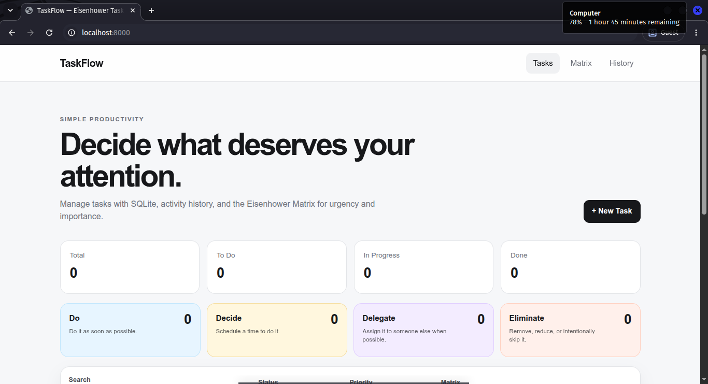

# TaskFlow — Eisenhower Task Manager

A lightweight task management web app built with **native PHP + SQLite**. TaskFlow combines regular task CRUD with an **Eisenhower Matrix** so tasks can be organized by urgency and importance while every meaningful change is stored in an activity history.

## Screenshot



Place your app screenshot in the **root folder** of this repository and name it:

```text
screenshot.png
```

GitHub will automatically display it in this README.

## Features

- Create, edit, and permanently delete tasks
- Task status: **To Do**, **In Progress**, **Done**
- Priority: **Low**, **Medium**, **High**
- Optional due dates
- Search and filters
- SQLite database with automatic initialization
- Responsive desktop and mobile UI
- Activity history / audit trail
- Database migration for the Eisenhower Matrix field

### Eisenhower Matrix

Each task belongs to one of four quadrants:

| Quadrant | Urgency | Importance | Recommended action |
| --- | --- | --- | --- |
| **Do** | Urgent | Important | Do it immediately |
| **Decide / Schedule** | Not urgent | Important | Schedule a time to do it |
| **Delegate** | Urgent | Not important | Assign it to someone else |
| **Eliminate** | Not urgent | Not important | Remove or reduce it |

The app includes a dedicated responsive **2×2 Matrix page**. On smaller screens the quadrants become a single-column layout.

> **Note:** “Eliminate” is an Eisenhower category. Moving a task there does not delete the database record. Permanent deletion is a separate action.

## History

The activity log records events such as:

- Task created
- Task updated
- Status changed
- Eisenhower quadrant changed
- Task deleted

Deleted task activity remains readable in history.

## Tech Stack

- PHP 8+
- SQLite
- PDO SQLite
- HTML5
- CSS3
- Small amount of native browser behavior only — no frontend framework

## Project Structure

```text
taskflow-eisenhower-matrix/
├── assets/
│   └── style.css
├── data/
│   └── schema.sql
├── includes/
│   ├── db.php
│   └── functions.php
├── .gitignore
├── .htaccess
├── README.md
├── screenshot.png
├── history.php
├── index.php
├── matrix.php
├── task-action.php
└── task-form.php
```

The SQLite database file `data/tasks.sqlite` is generated automatically and ignored by Git.

## Run Locally

Make sure PHP has the `pdo_sqlite` extension enabled.

### PHP built-in server

```bash
php -S localhost:8000
```

Open:

```text
http://localhost:8000
```

### XAMPP / Laragon

1. Put the project folder inside `htdocs` for XAMPP or `www` for Laragon.
2. Make sure PDO SQLite is enabled in PHP.
3. Start Apache.
4. Open the project through localhost.

## Database

### `tasks`

Stores:

- title
- description
- status
- priority
- Eisenhower quadrant
- due date
- created / updated timestamps

### `task_history`

Stores the activity audit trail. History uses a nullable task reference so records can remain after a task is permanently deleted.

## GitHub Repository

Recommended repository name:

```text
taskflow-eisenhower-matrix
```

Alternative names:

- `eisenhower-task-manager-sqlite`
- `eisenhower-task-manager-php`
- `php-sqlite-task-manager`
- `task-management-web-app`

Suggested GitHub description:

> Simple PHP + SQLite task manager with CRUD, activity history, filters, and an Eisenhower Matrix for urgency and importance.

Suggested topics:

```text
php sqlite task-manager eisenhower-matrix crud productivity web-app portfolio-project responsive-design
```

## Why This Project?

This repository intentionally avoids a heavy framework so the application logic is easy to inspect. It demonstrates practical CRUD operations, SQLite persistence, SQL queries, filtering, responsive interface design, database migration, and audit-history behavior in a compact project.

## Possible Improvements

- Authentication and multiple users
- Drag-and-drop tasks between Matrix quadrants
- Project/workspace support
- Recurring tasks
- Tags
- Dark mode
- CSRF protection for production use
- History export to CSV

## License

No license file is included by default. Add a license according to how you want others to use the source code. MIT is a common choice for an open-source portfolio project.
